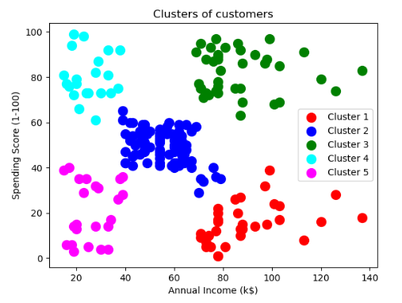
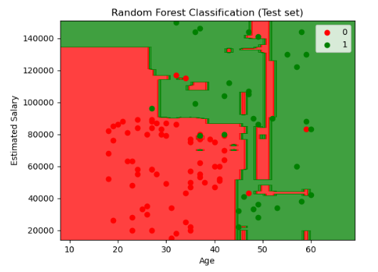
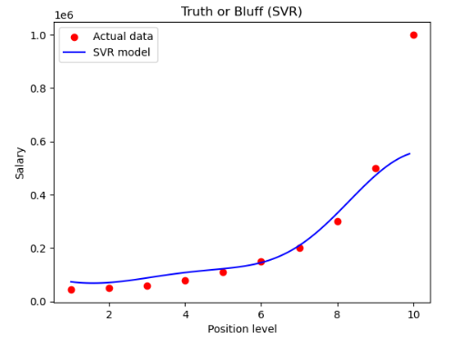

# 🚀 ML_Models  

This repository contains implementations of **Supervised and Unsupervised Machine Learning models** on multiple datasets.  
The goal is to provide a clear, hands-on understanding of ML algorithms, preprocessing, and evaluation using Jupyter Notebooks.  

---

## 🔹 Features  

### ✅ Implemented Models
- **Regression**
  - Linear Regression  
  - Multiple Linear Regression  
  - Polynomial Regression  
  - Support Vector Regression (SVR)  
- **Classification**
  - Logistic Regression  
  - K-Nearest Neighbors (KNN)  
  - Support Vector Machine (SVM)  
  - Decision Tree  
  - Random Forest  
  - Breast Cancer Detection  
- **Clustering**
  - K-Means Clustering  
  - Hierarchical Clustering  
- **Deep Learning**
  - TensorFlow basics  
  - Convolutional Neural Networks (CNN)  

### 🛠 Preprocessing
- Data cleaning & missing value handling  
- Feature scaling & encoding  
- Train-Test split & Cross-validation  

### 📈 Evaluation
- Accuracy, Precision, Recall  
- Confusion Matrix & Reports  
- RMSE & R² for regression  
- Decision boundaries & cluster plots  

---

## 📊 Tools & Libraries  
- **Core**: Python, NumPy, Pandas  
- **ML/DL**: Scikit-learn, TensorFlow, Keras  
- **Visualization**: Matplotlib, Seaborn  
- **Extras**: Pillow, imutils  

---

## 🔧 Installation  

Clone this repository and install dependencies:  
git clone https://github.com/Utkarsha2003/ML_Models.git
pip install -r requirements.txt

Run notebooks:
jupyter notebook

📸 Example Output
🔹 Clustering

🔹 Random Forest Classification

🔹 Support Vector Regression (SVR)

👨‍💻 Author
Utkarsha Medhekar
B.Tech CSE | ML & AI Enthusiast